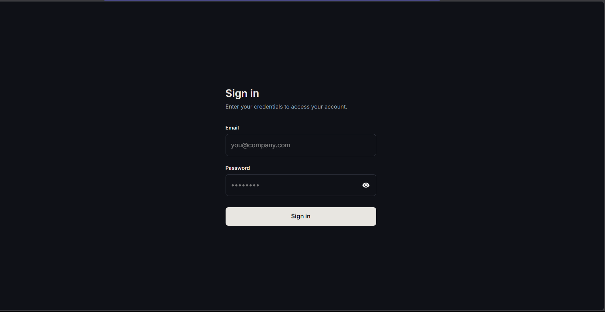
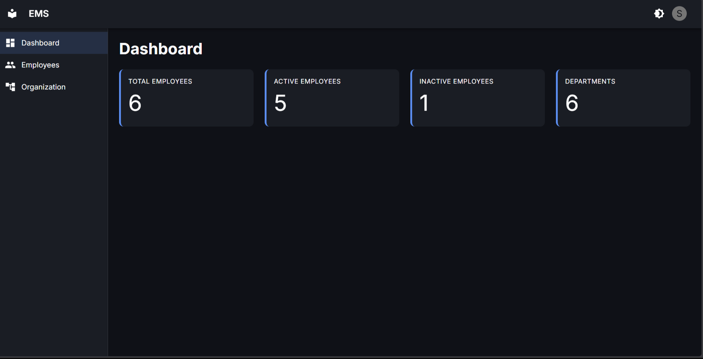
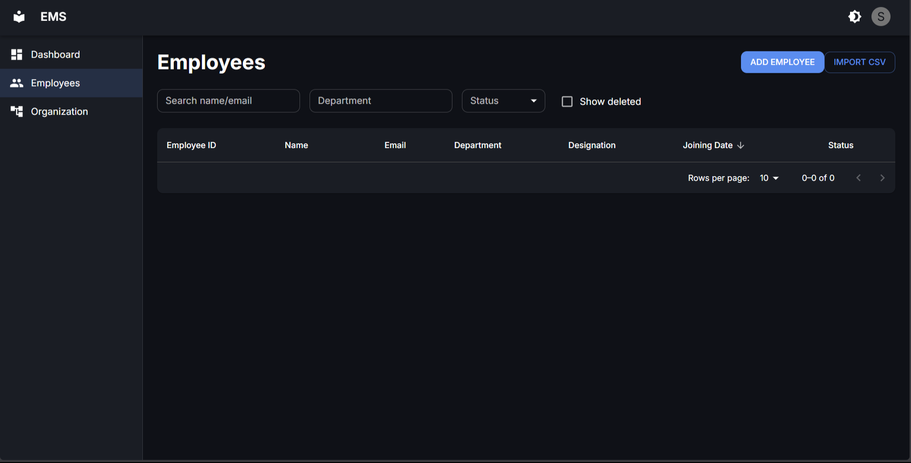
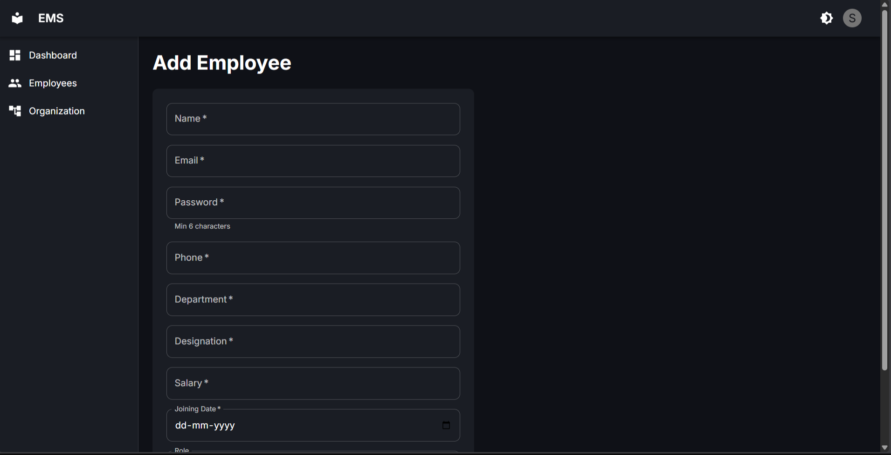
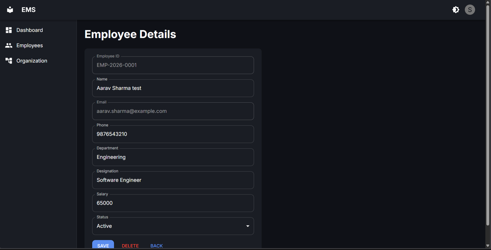
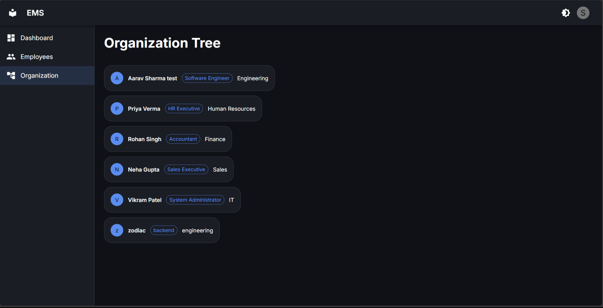
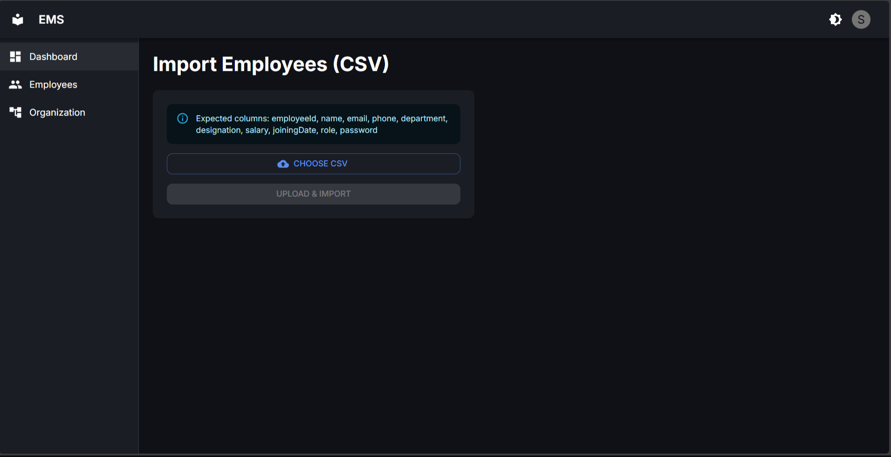

# API Documentation

Base URL: `http://localhost:5000/api`

Auth: JWT sent via HttpOnly cookie (`accessToken`), set automatically on login. No manual header needed from client.

---

## Auth

### POST `/auth/login`
**Body:**
```json
{ "email": "admin@ems.com", "password": "Welcome@123" }
```
**Response 200:**
```json
{ "success": true, "message": "Login successful", "user": { "id": "...", "email": "...", "role": "SUPER_ADMIN" } }
```
**Errors:** 401 Invalid credentials, 403 Account disabled

---

### POST `/auth/logout`
Auth: required
**Response 200:** `{ "success": true, "message": "Logged out" }`

---

### GET `/auth/me`
Auth: required
**Response 200:** `{ "user": { "id": "...", "role": "...", "email": "..." }, "ok": true }`

---

## Employees

### POST `/employee`
Auth: SUPER_ADMIN, HR_MANAGER
**Body:**
```json
{
  "name": "Jane Doe",
  "email": "jane@ems.com",
  "password": "Welcome@123",
  "phone": "9999999999",
  "department": "Engineering",
  "designation": "Software Engineer",
  "salary": 60000,
  "joiningDate": "2026-01-01",
  "role": "EMPLOYEE",
  "reportingManager": "<employeeId or null>"
}
```
`employeeId` is auto-generated (`EMP-2026-0001`), not sent by client.
**Response 201:** `{ "success": true, "message": "Created successful", "employee": {...} }`
**Errors:** 409 Email exists, 403 HR cannot assign Super Admin

---

### GET `/employee`
Auth: SUPER_ADMIN, HR_MANAGER
**Query params:** `search`, `department`, `status`, `role`, `sortBy` (`name`|`joiningDate`), `order` (`asc`|`desc`), `page`, `limit`
**Response 200:**
```json
{ "success": true, "employees": [...], "total": 42, "page": 1, "limit": 10 }
```

---

### GET `/employee/:id`
Auth: required (self or SUPER_ADMIN/HR_MANAGER)
**Response 200:** `{ "success": true, "employee": {...} }`
**Errors:** 403 Forbidden (employee viewing another profile), 404 Not found

---

### PUT `/employee/:id`
Auth: SUPER_ADMIN, HR_MANAGER
**Body:** any subset of `name, phone, department, designation, salary, status, role, reportingManager`
**Response 200:** `{ "success": true, "message": "Updated successful", "employee": {...} }`
**Errors:** 403 HR cannot modify/assign Super Admin

---

### PATCH `/employee/:id/profile`
Auth: self (employee)
**Body:** limited fields only — `phone`, `department`
**Response 200:** `{ "success": true, "employee": {...} }`

---

### DELETE `/employee/:id`
Auth: SUPER_ADMIN only
Soft delete — sets `isDeleted: true`, `status: INACTIVE`, deactivates linked Auth.
**Response 200:** `{ "success": true, "message": "Deleted successful" }`

---

### POST `/employee/import`
Auth: SUPER_ADMIN, HR_MANAGER
**Body:** `multipart/form-data`, field name `file` (CSV)
**CSV columns:** `employeeId,name,email,phone,department,designation,salary,joiningDate,role,password`
**Response 200:**
```json
{ "success": true, "message": "Import completed", "success": 8, "failed": [{ "email": "x@ems.com", "reason": "Email already exists" }] }
```

---

## Organization

### GET `/employee/:id/reportees`
Auth: required
**Response 200:** `{ "success": true, "reportees": [...] }`

---

### GET `/organization/tree`
Auth: required
**Response 200:**
```json
{ "success": true, "tree": [ { "_id": "...", "name": "...", "children": [...] } ] }
```

---

### PATCH `/employee/:id/manager`
Auth: SUPER_ADMIN, HR_MANAGER
**Body:** `{ "reportingManager": "<employeeId or null>" }`
**Response 200:** `{ "success": true, "message": "Manager updated", "employee": {...} }`
**Errors:** 400 Circular reporting not allowed, 400 Cannot be own manager

---

## Dashboard

### GET `/dashboard/stats`
Auth: SUPER_ADMIN, HR_MANAGER
**Response 200:**
```json
{
  "success": true,
  "stats": {
    "totalEmployees": 42,
    "activeEmployees": 38,
    "inactiveEmployees": 4,
    "departmentCount": 6
  }
}
```

---

## Error Format (all endpoints)
```json
{ "success": false, "message": "..." }
```
Status codes: `400` validation/bad request, `401` unauthorized, `403` forbidden, `404` not found, `409` conflict, `500` server error.

---

## Demo Screenshots

Place screenshot image files in a `screenshots/` folder at the repo root, then replace each path below (or drag-and-drop images directly into this section if viewing in an editor that supports it).

### Login Page


### Dashboard (Super Admin / HR Manager)


### Employee List (Search / Filter / Sort / Pagination)


### Create Employee


### Employee Detail / Edit


### Self Profile View (Employee role)


### Organization Tree


### CSV Import


### Dark Mode
